# InstallScout – user guide

InstallScout takes a Windows installer **all the way to Intune**. You give it an EXE, MSI, COM or MSIX. It does not run the installer — it analyzes the file, lets you edit the silent command, builds a local `.intunewin` and **uploads the Win32 app** with install, uninstall, detection and app logo.

Silent switches are one step. The destination is the package in Intune.

Version **1.8.54**. Quick start: [quickstart-en.md](quickstart-en.md). Technical reference: [reference-en.md](reference-en.md). Word edition: [InstallScout-guide.docx](InstallScout-guide.docx). Danish: [vejledning.md](vejledning.md).

| File | Engine | Typical result |
|---|---|---|
| `Git-2.51.0-64-bit.exe` | Inno Setup | Local and online agree on `/VERYSILENT …` · **System** · not unpacked |
| `jre-8u491-windows-x64.exe` | InstallShield | Local `/s /v"/qn"` · online Java 8 `/S` · **System** |
| `AcroRdrDC….exe` | Self Extractor | Outer `/sAll /rs /rps /msi /quiet` · online **Acrobat Reader** · **System** |
| `SlackSetup.exe` | Squirrel | Per-user · **User** |

---

## 1. Start and window

Double-click `InstallScoutPortable.exe` or run `Start.bat`. No installation is required. The UI defaults to **English**; switch to Dansk in the top-right corner. **About…** next to the language field shows the version, developer, and links to GitHub.

The download is **not code-signed**. Windows or company security may warn or block it. Choose Keep / Run anyway, ask IT to allow the file, or try it in a VM or Windows Sandbox without those policies.

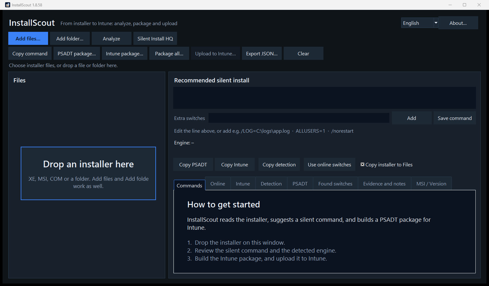

Drop an installer on the window, or use **Add files** / **Add folder**. The empty start shows **Drop an installer here** in the file list and a short introduction on the Commands tab. EXE, MSI, COM and a whole folder can be dropped.

The buttons sit on two rows. Top: add and **Analyze**. Below: copy, package and **Upload to Intune**. The language is changed at the top right. The default is English.

**Left:** files, engine and confidence (how sure the analysis is).  
**Right:** recommended silent command (editable), the **Extra switches** field, plus the tabs Commands, Online, Intune, Detection, PSADT, Found switches, Evidence and notes, and MSI / Version.

**Status and progress** sit on their own row under the buttons, so they stay visible when the window is not maximized.

| Button | Action |
|---|---|
| Add files… / Add folder… | Choose EXE, MSI, COM, MSIX |
| **Analyze** | Read the file locally |
| **Analyze** | Read the file locally, then look up WinGet and Chocolatey (name/vendor only) |
| **Silent Install HQ** | Opens a name search in the browser — file is not uploaded, command is not overwritten |
| Copy command | Silent line to the clipboard |
| PSADT package… | Folder with PSADT 4.1.8 |
| Intune package… | Local `.intunewin` + detection — **required** before upload |
| **Upload to Intune…** | Sign in and create the Win32 app (logo, context, detection, **supersedence**) |
| **Add / Save command** | Extra switches, or save the edited line |
| Use online switches | Overwrite the local command with the catalog |

---

## 2. Workflow

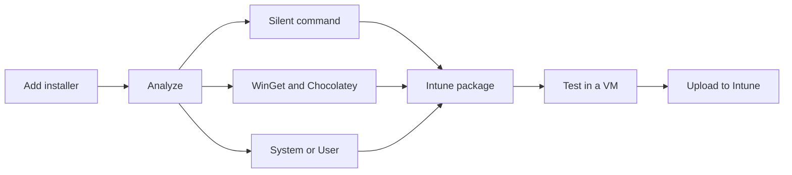

The process ends with upload. The silent command is a middle step.

1. Add the file and click **Analyze**.
2. Read the green silent command. Edit it, or add extra switches, then click **Save command** / **Add**.
3. Read the **Online** tab when it fills in. A confident local engine is kept if the catalog disagrees. A weak local guess is replaced when WinGet or Chocolatey has a matching product. On **none**, use **Silent Install HQ** (name search only).
4. Open **Intune** and check **Install context** (System/User).
5. Build an **Intune package** (local `.intunewin`). Test with `Invoke-AppDeployToolkit.exe`.
6. **Upload to Intune** — the dialog opens tall enough to show the name, command, logo, supersedence and sign-in. One Edge profile is shown; open the field to pick another. **Sign in to Intune**, **Cancel** and **Upload** share that row.

---

## 3. Local switch check

Local analysis looks inside the binary — markers, PE sections, VersionInfo, MSI properties and text switches in the file. It picks an engine (Inno, NSIS, InstallShield, MSI, Self Extractor, …) and builds the command from that engine’s known silent flags.

**Inner setup (unpack)** happens locally and **without running the installer**. The goal is the silent line (and the file copied into `Files\`) from the payload that actually installs the product.

| Situation | What InstallScout does |
|---|---|
| Wrapper: 7-Zip SFX, WinRAR SFX, IExpress, WiX Burn, InstallShield, Advanced Installer, Self Extractor | Looks for ZIP, embedded MSI, CAB, and 7z (bundled `7za`) |
| Unknown engine or very low confidence | Same cheap unpack (ZIP / MSI / CAB / 7z) |
| Clean engines: Inno, NSIS, Squirrel, DDPM, Wacom, Chrome, Python, … | **Does not** unpack — the outer EXE already has the right dialect |
| Self Extractor **with** outer silent flags (`/sAll`, `--silent`, `/silent`) | Keeps the outer command (typical Adobe-style `/sAll /rs /rps /msi /quiet`) |
| Self Extractor **without** those flags | Adopts the inner setup when it is found (often an MSI) |

The installer is never executed to unpack. Large vendor SFX files are therefore not extracted just to confirm a `/sAll` that is already in the file.

**What to look at**

- **Engine + confidence** — 75 %+ is typically usable. Below ~40 %, read the Evidence tab.
- **Recommended silent install** — the command PSADT and Intune use.
- **Found switches** — raw flags that actually appear in the file.
- **Evidence and notes** — why the engine was chosen, and pitfalls (e.g. `/S` does not work on Inno).

### Example: Git (Inno Setup)

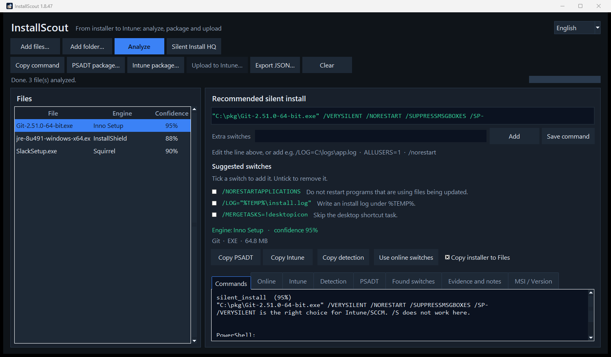

Local conclusion:

```text
Engine: Inno Setup · confidence 95 %
"C:\pkg\Git-2.51.0-64-bit.exe" /VERYSILENT /NORESTART /SUPPRESSMSGBOXES /SP-
```

Inno does **not** use `/S`. That is in the notes. The Commands tab also shows the PowerShell form.

### Example: Java 8 (InstallShield + embedded MSI)

Java Platform SE 8 is detected as InstallShield. The silent line becomes:

```text
jre-8u491-windows-x64.exe /s /v"/qn"
```

`/s` is InstallShield; `/v"/qn"` is passed to the embedded MSI. That is the local, file-based truth — even if WinGet names the product differently.

In the PSADT package, an InstallShield line that contains quotes is started through `cmd /d /s /c`, so `/v"/qn"` is preserved. The package elevates itself when it is not already running as administrator. Intune as SYSTEM is already administrator and skips that.

### Example: vendor Self Extractor (Adobe and others)

`FileDescription` / `ProductName` **Self Extractor** is a vendor wrapper class, not a product. Adobe, Lenovo and others use the same label.

- If `/sAll` or `/rps` is in the file, the recommended line is `"file.exe" /sAll /rs /rps /msi /quiet`.
- If `--silent` or `/silent` is in the file, that dialect is used instead.
- If no outer silent flag is found, the inner MSI/EXE is unpacked and those switches are used.
- The UI may still show *Adobe Self Extractor* as the engine name (from VersionInfo). The **product** used for Intune and online search is the real name or the file stem (`AcroRdrDC`), not the wrapper label.

**Other typical local defaults**

| Engine | Silent |
|---|---|
| MSI / WiX | `msiexec /i file.msi /qn` |
| NSIS | `/S` (capital S) |
| Advanced Installer | `/exenoui /qn` |
| WiX Burn | `/quiet` |
| 7-Zip SFX / Wacom | `/s` |
| Self Extractor | `/sAll …` (uninstall `/uninst`) or harvested `--silent` / `/silent` |
| DDPM | `/Silent` (not InstallShield `/s /v"/qn"`) |

`/install` is not added. It is already the default action for WiX Burn. `/norestart` is not added either. Inno Setup still uses its own `/NORESTART`. Type `/norestart` under **Extra switches** when a quiet install must not reboot the PC.

### Manual switches

The green line is **editable**. Under it are **Extra switches**, **Add** and **Save command**.

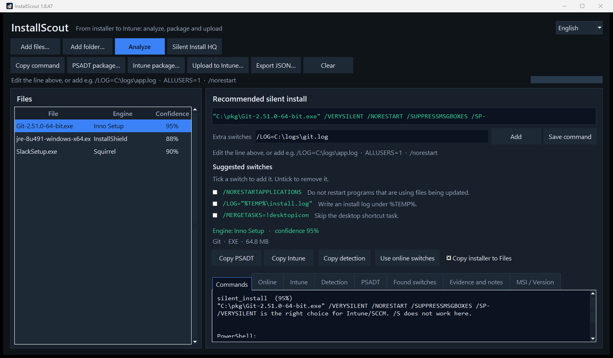

- Edit the whole command and click **Save command** (or press Enter in the line).
- Put only the extra flags in **Extra switches**, e.g. `/LOG=C:\logs\app.log` or `ALLUSERS=1`, then click **Add**. The installer path is left alone.
- **Suggested switches** appear under that, when the file or its engine has optional flags. Each line has a short description. Tick it to add the switch to the command, and untick to remove it. Logi Options+ `/analytics no` and `/sso no` are examples of flags read from the installer; Inno `/LOG` and MSI `ALLUSERS=1` are examples that follow the engine.

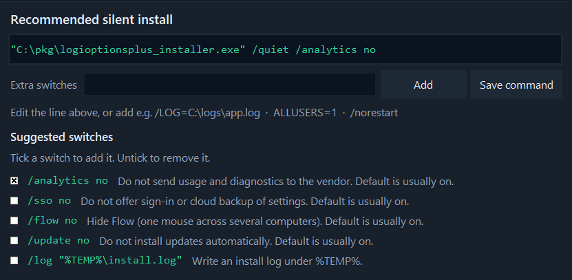

- Changes are also saved when you package, copy or check online.
- If the command changes, **build the Intune package again** before upload (Upload to Intune otherwise stays grey, because the old `.intunewin` is invalid).

---

## 4. Online switch check

**Analyze** looks the product up in WinGet and Chocolatey after the local result is shown:

- WinGet (winget.run + `winget.exe` on the machine)
- Chocolatey Community

**Silent Install HQ** opens a browser search for the product name on [silentinstallhq.com](https://silentinstallhq.com/). The installer file is **not** uploaded, and the silent command is **not** overwritten. Use it when WinGet/Chocolatey conflict or return nothing — vendor-specific CLIs often live there.

Only the **product name and vendor** are sent — not the installer file.

Search uses both the long product name and catalog names. Wrapper labels are stripped so WinGet is not queried for *Adobe Self Extractor*. Compact file names are expanded to names the catalogs actually index:

| In the file | Online search |
|---|---|
| *Java Platform SE 8 U491* | **Java 8** (`Oracle.JavaRuntimeEnvironment`) |
| *Adobe Self Extractor* + `AcroRdrDC….exe` | **Acrobat Reader** |
| `GoogleChromeStandaloneEnterprise64.exe` | **Google Chrome** |
| `npp.8.6.Installer.x64.exe` | **Notepad++** |

The **Online** tab shows a result:

| Result | Meaning |
|---|---|
| **match** | Same installer family (Inno, MSI, NSIS, …) |
| **partial** | Some flags overlap |
| **conflict** | Different family — read the sources, test in a VM |
| **none** | No hits (e.g. an internal/unnamed package) |
| **error** | Network or source failure |

### Example: Git — local and online agree

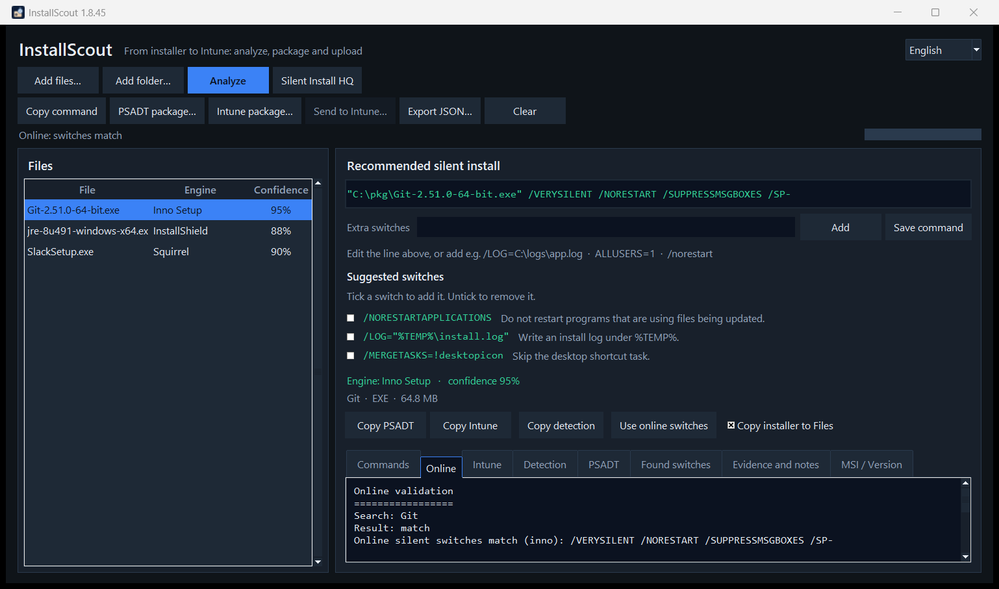

```text
Search: Git
Result: match
Online silent switches match (inno): /VERYSILENT /NORESTART /SUPPRESSMSGBOXES /SP-

Local switches: /VERYSILENT /NORESTART /SUPPRESSMSGBOXES /SP-

winget.exe: Git.Git
Chocolatey: git
```

Here you can keep the local command.

### Example: Java — the catalog is coarser than the file

Online finds **Java 8** with `/S`. Locally it is InstallShield `/s /v"/qn"`. Both may be “quiet enough”, but the local line is more precise for *this* Oracle wrapper.

- Keep local switches when they match the engine in the file.
- Use **Use online switches** if the local engine is uncertain and the catalog is clear (as with Git/Inno).
- Build the Intune package **again** if you overwrite the command.

Catalogs can be wrong (wrong edition, OpenJDK instead of Oracle). Always test in a VM.

---

## 5. User vs system context

Intune Win32 must run as **system** or **user**. The wrong choice shows “installed” for the wrong account, missing Program Files files, or detection that never matches.

InstallScout infers context automatically and shows it on the **Intune** tab, in `Intune.txt` and in the Upload to Intune dialog. You can override it at upload.

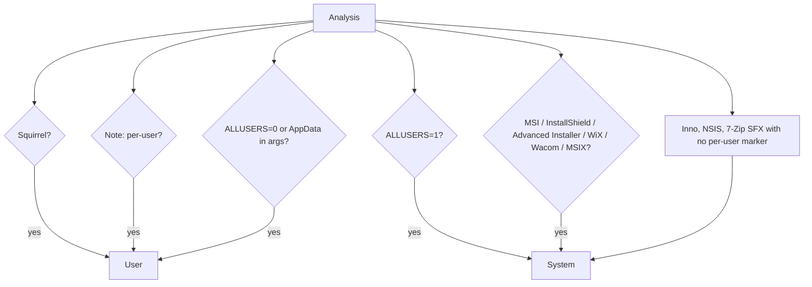

An installer path under `%LOCALAPPDATA%\Temp` does **not** count as user context — only the arguments after the file path.

### Default: System (machine install)

Most business Win32 packages should run as system: MSI with `ALLUSERS=1`, InstallShield, Advanced Installer, Inno/NSIS without a per-user flag.

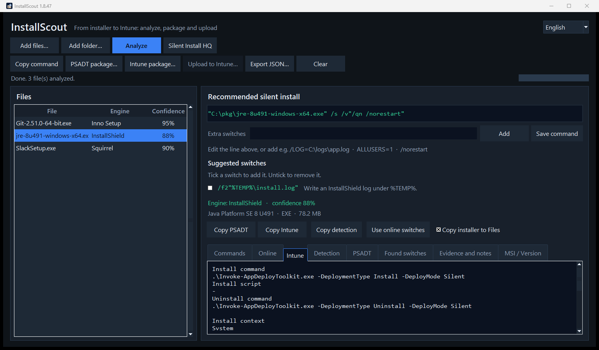

```text
Install context
System
InstallShield is typically a machine install and requires system context.

Minimum operating system     Windows 10 22H2
Installation time required   60
Device restart behavior      No specific action
```

The same default fields are used when uploading to Intune.

### Exception: User (per-user)

Squirrel (Slack, many Electron apps), `InstallAllUsers=0` / `ALLUSERS=0`, or an install that explicitly targets AppData.

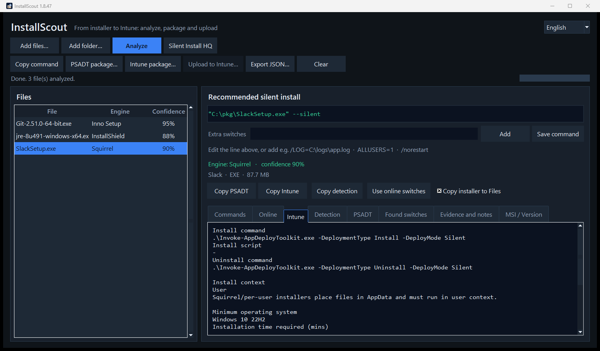

```text
Install context
User
Squirrel/per-user installers place files in AppData and must run in user context.
```

In **Upload to Intune**, System/User is preselected, but you can change it if you know the package better than the guess.

**Why it matters**

| Context | Typical target | Detection |
|---|---|---|
| System | `C:\Program Files`, HKLM Uninstall | Machine ARP / MSI ProductCode |
| User | `%LOCALAPPDATA%`, HKCU Uninstall | The user’s Uninstall key — fails if the app runs as system |

---

## 6. Upload to Intune

Upload is a **two-step run**: first a local `.intunewin`, then **Upload to Intune**. The program uploads the package you already saved — it does not repackage on upload.

```text
Analyze  →  Intune package… (local .intunewin)  →  Upload to Intune… (Graph upload)
```

What lands in Intune is a Win32 app with:

- install and uninstall command (`Invoke-AppDeployToolkit.exe … Silent`)
- custom detection script (`Detection.ps1`, 64-bit PowerShell). See **Detection** below.
- **Install context** (System or User — prefilled, can be overridden)
- **App logo** (`largeIcon` in Company Portal — from the EXE, a file, or the clipboard)
- Minimum OS **Windows 10 22H2**, **60** minutes, restart **No specific action**

### Step 1 — local Intune package

**Intune package…** saves:

| File | Contents |
|---|---|
| `*.intunewin` | Encrypted Win32 payload (same format as Microsoft Win32 Content Prep) |
| PSADT source | `Invoke-AppDeployToolkit.exe` + script + `Files\` |
| `Intune.txt` | Fields for the portal |
| `Detection.ps1` | Custom detection |

### Detection

Intune treats the app as installed when `Detection.ps1` exits 0 and writes a line to STDOUT. Empty output means not installed. The script does not throw. The same rules apply to every vendor.

| What the installer has | What is matched |
|---|---|
| Product code (MSI, or a GUID in the uninstall command) | That code in the uninstall registry, and the version |
| EXE without a product code | Display name, publisher and version |
| MSIX | Package name, and the version when it is known |

- **Name.** The uninstall name may be the product without a trailing Installer, Setup, Bootstrapper, or Driver word. `Logi Options+ Installer` matches `Logi Options+`. `Wacom Tablet Driver` matches `Wacom Tablet`. The registry key name counts as well. A leftover generic word such as Advanced is not used as the name.
- **Publisher.** Legal suffixes are ignored, so `Logitech, Inc.` matches `Logitech`, and `Microsoft Corporation` matches `Microsoft`.
- **Version.** When the installer has a version, `DisplayVersion` must be the same or newer. The comparison is numeric. For an installer at `2.7.961922`, that version and `2.8.1` count; `2.6` does not. `2.8.1` is only an example of the comparison. A hyphen revision such as `6.4.14-1` is also satisfied by `6.4.14`. If no version was read, version is not required. A key named as the product still counts when those values were never written.
- Product code is tried first. When it is missing, name, publisher and version are used. Both the machine and the user uninstall keys are read.

Until a package exists for the selected file, **Upload to Intune** is grey. After the package is saved, the button becomes active:

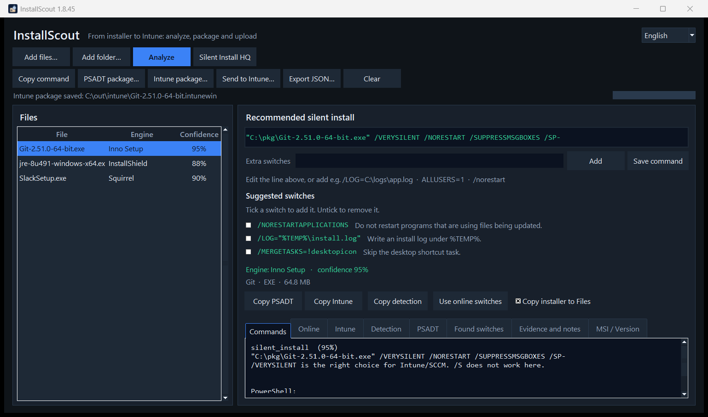

Test the source before upload:

```powershell
.\Invoke-AppDeployToolkit.exe -DeploymentType Install -DeployMode Silent
```

### Step 2 — Upload to Intune

Click **Upload to Intune…**. The dialog sizes itself so the content is visible without scrolling. One Edge profile is shown at the bottom. Open the field to pick another. **Sign in to Intune**, **Cancel** and **Upload** share that row.

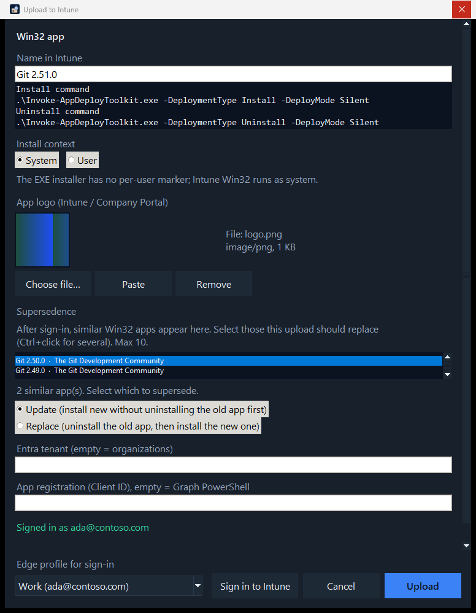

**Logo**

- InstallScout first tries to extract the icon from the EXE (and looks for `logo.png` / `icon.ico` next to the file).
- **Choose file…** — PNG, JPEG, ICO, GIF or BMP.
- **Paste** (Ctrl+V) — image or file from the clipboard.
- **Remove** — upload without a logo.
- MSI often only has the Windows default icon; use a file or paste.

**In the dialog**

1. Edit **Name in Intune** if the detected name should not be the name in Company Portal. Version stays in Display version.
2. Check the install, uninstall and detection summary.
3. Confirm **Install context** (System/User). Change it only if you know the package better.
4. Check the **app logo** (preview). Override with a file or paste if the automatic icon is wrong.
5. Tenant and Client ID can stay empty: then *organizations* and Microsoft Graph PowerShell are used. InstallScout does **not** create an Entra app.
6. **Edge profile for sign-in** shows the selected profile. The work profile is selected when it can be recognized. Open the list to pick another.
7. **Sign in to Intune** — browser login (PKCE, localhost) in the selected Edge profile. Device code is not used, because Conditional Access often blocks it.
8. After sign-in: optionally choose **supersedence** (see below). Nothing is selected automatically.
9. **Upload** — creates the app, uploads `.intunewin`, sets detection, logo and optional supersedence. The status line shows progress.

### Supersedence

In **Upload to Intune** the new Win32 app can replace older versions in the tenant — the same feature as *Supersedence* in the Intune portal.

Wait until the status is **Signed in as …**, not only that the Edge profile opened. Only then does InstallScout look up Win32 apps. The search uses the **product name** (`startswith` on `displayName`), not the entire Win32 catalogue. The list shows apps whose names look like the product — e.g. *Git 2.50.0* when you send *Git 2.51.0*. The same vendor with a different product is typically omitted.

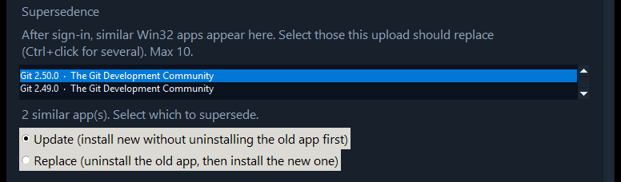

- Nothing is selected automatically. Ctrl+click to select (at most **10** — Intune’s limit).
- **Update** (default) — install the new app without uninstalling the old one first.
- **Replace** — uninstall the old app, then install the new one.
- Relationships are written only after the new app is created (Graph `updateRelationships`).
- If supersedence fails, the new app still remains. The dialog shows which apps were superseded, or the error. You can set the relationship in the portal afterwards.

```powershell
.\InstallScoutPortable.exe --cli .\setup.exe --intune C:\out\intune --publish-intune --supersede update
.\InstallScoutPortable.exe --cli .\setup.exe --intune C:\out\intune --publish-intune --supersede replace --supersede-id <app-guid>
```

`--supersede update|replace` matches on product name as in the GUI. Repeat `--supersede-id` if you already know the Intune app ID.

After success, a link to the app in the Intune portal opens.

**What Graph writes on the app**

| Field | Value |
|---|---|
| App type | Win32 (`win32LobApp`) |
| Install command | `.\Invoke-AppDeployToolkit.exe -DeploymentType Install -DeployMode Silent` |
| Uninstall command | `.\Invoke-AppDeployToolkit.exe -DeploymentType Uninstall -DeployMode Silent` |
| Detection | PowerShell script, not 32-bit, no signature requirement |
| runAsAccount | `system` or `user` |
| Minimum OS | Windows 10 22H2 |
| Max runtime | 60 minutes |
| Restart | No specific action (`suppress`) |
| Logo | `largeIcon` (PNG/JPEG from EXE, file or clipboard) |
| Supersedence | Optional: **Update** or **Replace** against up to 10 older Win32 apps |

### PSADT package without Intune

**PSADT package…** is the same source without `.intunewin` — useful for VM testing before you package for Intune.

### Command-line upload

```powershell
.\InstallScoutPortable.exe --cli .\setup.exe --intune C:\out\intune --publish-intune --icon .\logo.png
```

`--publish-intune` requires `--intune` (local package first), same as in the GUI. Without `--icon`, the logo is taken from the EXE if one is found.

### Sign-in and permissions

Sign-in opens in the browser with PKCE. Device code is not used.

Windows DPAPI encrypts the access token and the refresh token for the current Windows user, in `%LOCALAPPDATA%\InstallScout\graph.json`. The saved session is bound to the selected tenant and Client ID. A different pair does not reuse it. A plaintext token file from an older version is deleted and cannot be used. Sign-out deletes the file.

- Windows 10 or 11. Switch lookup and a local package do not need Azure.
- Microsoft Edge. Sign-in opens in an Edge profile.
- An account that can create Win32 apps: the Entra role **Intune Administrator**, or the Intune role **Application Manager**. A custom role with the same app permissions works too.
- Admin consent in the tenant for `DeviceManagementApps.ReadWrite.All`.
- Default Client ID: Microsoft Graph PowerShell (`14d82eec-204b-4c2f-b7e8-296a70dab67e`). InstallScout does not create an app registration.
- Conditional Access can still block. IT can create a public client with redirect `http://localhost` and set the Client ID in the dialog.

---

## 7. Command line

`InstallScoutPortable.exe` with no arguments opens the GUI. For scripts:

```powershell
# Local analysis
.\InstallScoutPortable.exe --cli "C:\installers\Git-64-bit.exe"

# Local + online
.\InstallScoutPortable.exe --cli "C:\installers\jre-8u491-windows-x64.exe" --online

# Silent Install HQ (name search in the browser; does not upload the file)
.\InstallScoutPortable.exe --cli "C:\installers\DDPM-Setup.exe" --sihq

# JSON
.\InstallScoutPortable.exe --cli .\setup.exe --json --out .\analyse.json

# Extra switches
.\InstallScoutPortable.exe --cli .\setup.exe --switches "/LOG=C:\logs\app.log"

# Local Intune package
.\InstallScoutPortable.exe --cli .\setup.exe --intune C:\out\intune

# Package + upload + logo (requires --intune)
.\InstallScoutPortable.exe --cli .\setup.exe --intune C:\out\intune --publish-intune --icon .\logo.png

# Upload and supersede matching Win32 apps
.\InstallScoutPortable.exe --cli .\setup.exe --intune C:\out\intune --publish-intune --supersede update
```

From source: `python -m installscout` with the same flags. Use `--lang da` for Danish CLI text.

---

## 8. Supported engines

MSI, Inno Setup, NSIS, InstallShield, WiX Burn, Advanced Installer, InstallAware, BitRock, Squirrel, Wise, install4j, Qt Installer, 7-Zip SFX, Wacom, WinRAR SFX, IExpress, Self Extractor, DDPM, MSIX/AppX, ClickOnce.

Unknown engine: look at **Found switches** and **Evidence**. Analyze also asks WinGet and Chocolatey and uses that hit when the local guess is weak. Wrappers and unknown EXEs are unpacked locally first so an inner MSI can replace *Unknown 15 %*.

---

## 9. Limits

- **About…** checks GitHub for a newer release. The button shows **About · Update** when one is available.
- The download is **not code-signed**. Windows or company security may warn or block it. Choose Keep / Run anyway, ask IT to allow the file, or try it in a VM or Windows Sandbox without those policies.
- The program **does not install** anything. Unpack never runs the installer. Test the silent line in a VM.
- A bundled 7-Zip Extra `7za` is used for inner 7z payloads, so system 7-Zip is not required.
- Online catalogs often know a different name or a newer build than your file. Wrapper VersionInfo (*Self Extractor*) is not a catalog product.
- Context is a qualified guess. Override it in Upload to Intune if you know better.
- Intune upload needs Graph permission and can hit Conditional Access.
- Installer binaries are not sent over the network during the online check.
- Upload to Intune is inactive until a local `.intunewin` exists for the selected file.
- MSI often has no usable icon. Use **Choose file…** or **Paste**.
- Manual switches overwrite the recommended line in PSADT; test in a VM.
- The supersedence list appears only after sign-in has finished (*Signed in as …*).
- If supersedence fails, the new Win32 app still remains in Intune.
