# InstallScout – vejledning

InstallScout tager en Windows-installer **hele vejen til Intune**. Du giver det en EXE, MSI, COM eller MSIX. Det kører ikke installeren – det analyserer filen, lader dig rette silent-kommandoen, laver en lokal `.intunewin` og **uploader Win32-appen** med install, uninstall, detection og app-logo.

Silent-switche er ét trin. Målet er pakken i Intune.

Version **1.8.48**. Quick start: [quickstart.md](quickstart.md). Teknisk reference: [reference.md](reference.md). Word-udgave: [InstallScout-vejledning.docx](InstallScout-vejledning.docx). English: [guide.md](guide.md) · [InstallScout-guide.docx](InstallScout-guide.docx).

| Fil | Motor | Typisk resultat |
|---|---|---|
| `Git-2.51.0-64-bit.exe` | Inno Setup | Lokal og online enige om `/VERYSILENT …` · **System** · pakkes ikke ud |
| `jre-8u491-windows-x64.exe` | InstallShield | Lokal `/s /v"/qn"` · online Java 8 `/S` · **System** |
| `AcroRdrDC….exe` | Self Extractor | Ydre `/sAll /rs /rps /msi /quiet` · online **Acrobat Reader** · **System** |
| `SlackSetup.exe` | Squirrel | Per-user · **User** |

---

## 1. Start og vindue

Dobbeltklik `InstallScoutPortable.exe` eller kør `Start.bat`. Programmet kræver ikke installation. **Om…** ved siden af sprogfeltet viser version, udvikler og links til GitHub.

Downloadet er **ikke codesigned**. Windows eller virksomhedens sikkerhed kan advare eller blokere det. Vælg Behold / Kør alligevel, bed IT om at tillade filen, eller prøv den i en VM eller Windows Sandbox uden de politikker.

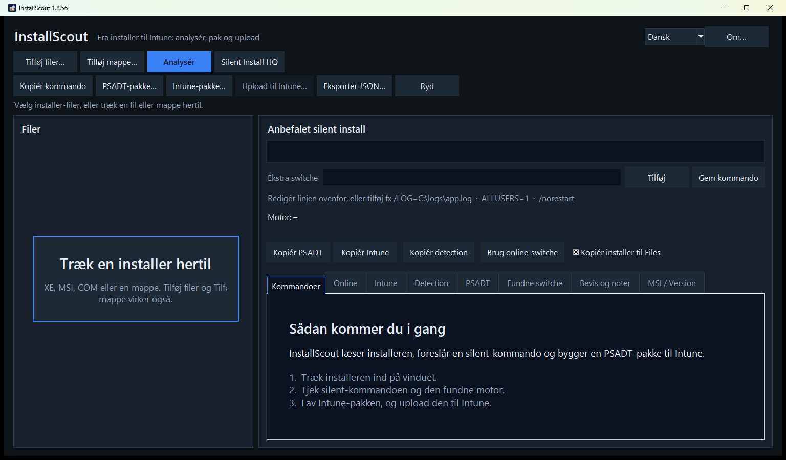

Træk en installer ind på vinduet, eller brug **Tilføj filer** / **Tilføj mappe**. Den tomme start viser **Træk en installer hertil** i fillisten og en kort introduktion under fanen Kommandoer. EXE, MSI, COM og en hel mappe kan slippes.

Knapperne ligger på to rækker. Øverst: tilføj og **Analysér**. Nedenunder: kopiér, pakke og **Upload til Intune**. Sproget skiftes øverst til højre. Standard er English.

**Venstre:** filer, motor og sikkerhed (hvor sikker analysen er).  
**Højre:** anbefalet silent-kommando (redigerbar), feltet **Ekstra switche**, plus fanerne Kommandoer, Online, Intune, Detection, PSADT, Fundne switche, Bevis og MSI/Version.

Under knapperne ligger **status og progress** på en egen linje, så de er synlige også når vinduet ikke er maksimeret.

| Knap | Funktion |
|---|---|
| Tilføj filer / mappe | Vælg EXE, MSI, COM, MSIX |
| **Analysér** | Lokal læsning af filen |
| **Analysér** | Læser filen lokalt og slår derefter op i WinGet og Chocolatey (kun navn/vendor) |
| **Silent Install HQ** | Åbner en navnesøgning i browseren – filen uploades ikke, kommandoen overskrives ikke |
| Kopiér kommando | Silent-linjen til udklipsholder |
| PSADT-pakke… | Mappe med PSADT 4.1.8 |
| Intune-pakke… | Lokal `.intunewin` + detection – **skal** laves før upload |
| **Upload til Intune…** | Log på og opret Win32-appen (logo, context, detection, **supersedence**) |
| **Tilføj / Gem kommando** | Manuelle extra switche eller gem den redigerede linje |
| Brug online-switche | Overskriv den lokale kommando med katalogets |

---

## 2. Arbejdsgang

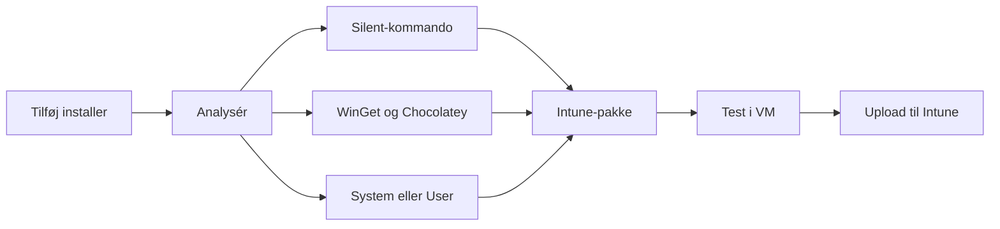

Hele forløbet slutter med upload. Silent-kommandoen er et mellemtrin.

1. Tilføj filen og klik **Analysér**.
2. Læs den grønne silent-kommando. Ret den, eller tilføj extra switche, og klik **Gem kommando** / **Tilføj**.
3. Læs fanen **Online**, når den bliver udfyldt. En sikker lokal motor beholdes, hvis kataloget er uenigt. Et svagt lokalt gæt skiftes, når WinGet eller Chocolatey har et matchende produkt. Ved **none**: **Silent Install HQ** (kun navnesøgning).
4. Åbn **Intune** og tjek **Install context** (System/User).
5. Lav **Intune-pakke** (lokal `.intunewin`). Test med `Invoke-AppDeployToolkit.exe`.
6. **Upload til Intune** – dialogen åbner, så navn, kommando, logo, afløsning og login er med fra start. Én Edge-profil vises; fold feltet ud for at vælge en anden. **Log på Intune**, **Annuller** og **Upload** står på samme række.

---

## 3. Lokal kontrol af switche

Lokal analyse kigger i binæren – markører, PE-sektioner, VersionInfo, MSI-egenskaber og tekst-switche i filen. Den vælger en motor (Inno, NSIS, InstallShield, MSI, Self Extractor, …) og bygger kommandoen ud fra den motors kendte silent-flag.

**Indre setup (udpakning)** sker lokalt og **uden at køre installeren**. Målet er silent-linjen (og filen i `Files\`) fra den payload, der faktisk installerer produktet.

| Situation | Hvad InstallScout gør |
|---|---|
| Wrapper: 7-Zip SFX, WinRAR SFX, IExpress, WiX Burn, InstallShield, Advanced Installer, Self Extractor | Leder efter ZIP, indlejret MSI og CAB |
| Ukendt motor eller meget lav sikkerhed | Samme billige udpakning (ZIP / MSI / CAB) |
| Rene motorer: Inno, NSIS, Squirrel, DDPM, Wacom, Chrome, Python, … | Pakker **ikke** ud – den ydre EXE har allerede den rigtige dialect |
| Self Extractor **med** ydre silent-flag (`/sAll`, `--silent`, `/silent`) | Beholder den ydre kommando (typisk Adobe-stil `/sAll /rs /rps /msi /quiet`) |
| Self Extractor **uden** de flag | Bruger den indre setup, når den findes (ofte en MSI) |

Installeren køres aldrig for at pakke ud. Store vendor-SFX’er udtrækkes derfor ikke bare for at bekræfte et `/sAll`, der allerede står i filen.

**Hvad du skal kigge efter**

- **Motor + sikkerhed** – 75 %+ er typisk brugbart. Under ~40 % skal du læse bevis-fanen.
- **Anbefalet silent install** – den kommando, PSADT og Intune bruger.
- **Fundne switche** – rå flag, der faktisk står i filen.
- **Bevis og noter** – hvorfor motoren blev valgt, og faldgruber (fx at `/S` ikke virker på Inno).

### Eksempel: Git (Inno Setup)

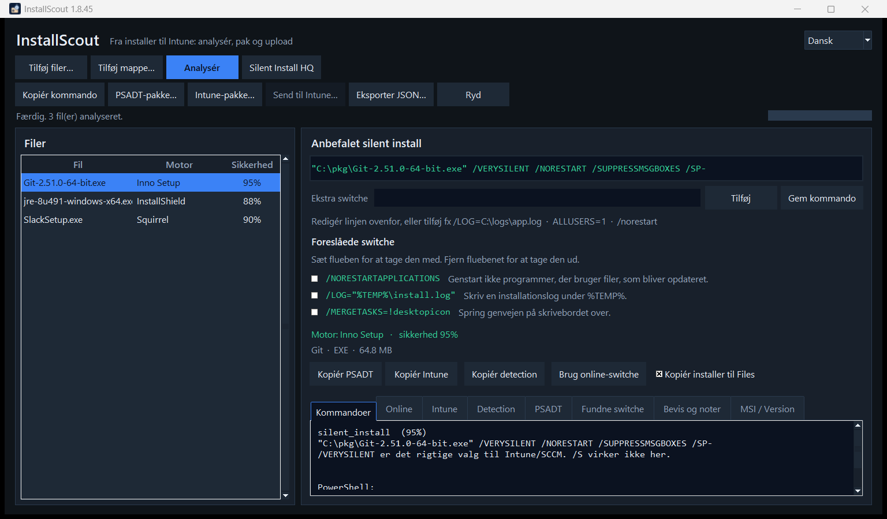

Her er den lokale konklusion:

```text
Motor: Inno Setup · sikkerhed 95 %
"C:\pkg\Git-2.51.0-64-bit.exe" /VERYSILENT /NORESTART /SUPPRESSMSGBOXES /SP-
```

Inno bruger **ikke** `/S`. Det står i noterne. Kommandoer-fanen viser også PowerShell-varianten.

### Eksempel: Java 8 (InstallShield + indlejret MSI)

Java Platform SE 8 detekteres som InstallShield. Silent-linjen bliver:

```text
jre-8u491-windows-x64.exe /s /v"/qn"
```

`/s` er InstallShield; `/v"/qn"` sendes videre til den indlejrede MSI. Det er den lokale, filbaserede sandhed – også selv om WinGet kalder produktet noget andet.

I PSADT-pakken startes en InstallShield-linje med anførselstegn via `cmd /d /s /c`, så `/v"/qn"` bevares. Pakken hæver sig selv, hvis den ikke allerede kører som administrator. Intune som SYSTEM er allerede administrator og springer det over.

### Eksempel: vendor Self Extractor (Adobe og andre)

`FileDescription` / `ProductName` **Self Extractor** er en vendor-wrapper-klasse, ikke et produkt. Adobe, Lenovo og andre bruger samme etiket.

- Hvis `/sAll` eller `/rps` står i filen, bliver linjen `"fil.exe" /sAll /rs /rps /msi /quiet`.
- Hvis `--silent` eller `/silent` står i filen, bruges den dialect i stedet.
- Hvis der ikke er et ydre silent-flag, udpakkes den indre MSI/EXE, og de switche bruges.
- UI kan stadig vise *Adobe Self Extractor* som motor-navn (fra VersionInfo). **Produktet** til Intune og online-søgning er det rigtige navn eller filstammen (`AcroRdrDC`), ikke wrapper-etiketten.

**Andre typiske lokale defaults**

| Motor | Silent |
|---|---|
| MSI / WiX | `msiexec /i fil.msi /qn` |
| NSIS | `/S` (stort S) |
| Advanced Installer | `/exenoui /qn` |
| WiX Burn | `/quiet` |
| 7-Zip SFX / Wacom | `/s` |
| Self Extractor | `/sAll …` (uninstall `/uninst`) eller høstet `--silent` / `/silent` |
| DDPM | `/Silent` (ikke InstallShield `/s /v"/qn"`) |

`/install` sættes ikke på. Det er allerede standardhandlingen for WiX Burn. `/norestart` sættes heller ikke på. Inno Setup beholder sin egen `/NORESTART`. Skriv `/norestart` under **Ekstra switche**, hvis en stille installation ikke må genstarte pc'en.

### Manuelle switche

Den grønne linje er **redigerbar**. Under den ligger **Ekstra switche**, **Tilføj** og **Gem kommando**.

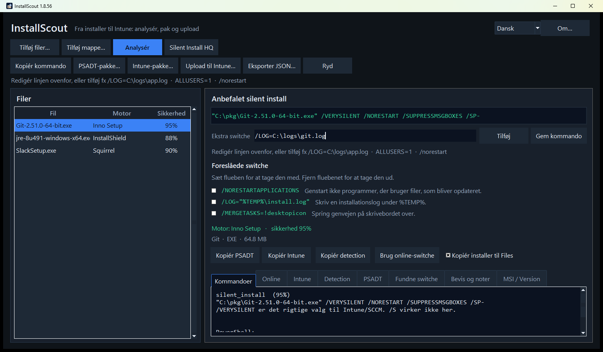

- Ret hele kommandoen og klik **Gem kommando** (eller Enter i linjen).
- Skriv kun de extra flag i **Ekstra switche**, fx `/LOG=C:\logs\app.log` eller `ALLUSERS=1`, og klik **Tilføj**. Stien til installeren røres ikke.
- **Foreslåede switche** vises under feltet, når filen eller motoren har valgfrie flag. Hver linje har en kort beskrivelse. Sæt flueben for at tage switchen med i kommandoen, og fjern det for at tage den ud. Logi Options+ `/analytics no` og `/sso no` er eksempler på flag læst i installeren; Inno `/LOG` og MSI `ALLUSERS=1` er eksempler, der følger motoren.

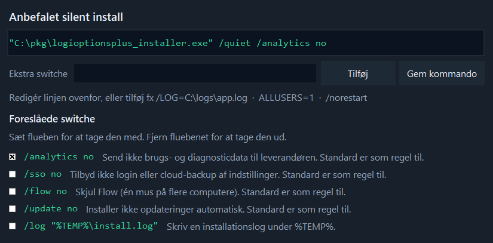

- Ændringer gemmes også, når du pakker, kopierer eller tjekker online.
- Hvis kommandoen ændres, skal **Intune-pakken laves igen** før upload (Upload til Intune bliver ellers grå, fordi den gamle `.intunewin` er ugyldig).

---

## 4. Online kontrol af switche

**Analysér** slår produktet op i WinGet og Chocolatey, når det lokale resultat er vist:

- WinGet (winget.run + `winget.exe` på maskinen)
- Chocolatey Community

**Silent Install HQ** åbner en browsersøgning på produktnavnet på [silentinstallhq.com](https://silentinstallhq.com/). Installer-filen **uploades ikke**, og silent-kommandoen **overskrives ikke**. Brug den, når WinGet/Chocolatey er i **conflict** eller **none** – vendor-specifikke CLI’er ligger ofte der.

Der sendes **kun produktnavn og vendor** – ikke installer-filen.

Søgningen bruger både det lange produktnavn og katalognavne. Wrapper-etiketter strippes, så WinGet ikke slås op på *Adobe Self Extractor*. Kompakte filnavne udvides til navne, katalogerne faktisk indekserer:

| I filen | Online-søgning |
|---|---|
| *Java Platform SE 8 U491* | **Java 8** (`Oracle.JavaRuntimeEnvironment`) |
| *Adobe Self Extractor* + `AcroRdrDC….exe` | **Acrobat Reader** |
| `GoogleChromeStandaloneEnterprise64.exe` | **Google Chrome** |
| `npp.8.6.Installer.x64.exe` | **Notepad++** |

Fanen **Online** viser et resultat:

| Resultat | Betydning |
|---|---|
| **match** | Samme installer-familie (Inno, MSI, NSIS, …) |
| **partial** | Nogle flag overlapper |
| **conflict** | Anden familie – læs kilderne, test i VM |
| **none** | Ingen træffer (fx intern/unavngivet pakke) |
| **error** | Netværk eller kildefejl |

### Eksempel: Git – lokal og online enige

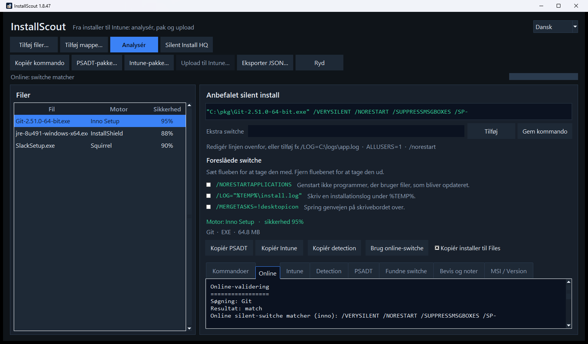

```text
Søgning: Git
Resultat: match
Online silent-switche matcher (inno): /VERYSILENT /NORESTART /SUPPRESSMSGBOXES /SP-

Lokale switche: /VERYSILENT /NORESTART /SUPPRESSMSGBOXES /SP-

winget.exe: Git.Git
Chocolatey: git
```

Her kan du trygt beholde den lokale kommando.

### Eksempel: Java – kataloget er grovere end filen

Online finder **Java 8** med `/S`. Lokalt er InstallShield `/s /v"/qn"`. Begge kan være “stille nok”, men den lokale linje er mere præcis til *denne* Oracle-wrapper.

- Behold lokale switche, når de matcher motoren i filen.
- Brug **Brug online-switche**, hvis den lokale motor er usikker, og kataloget er tydeligt (som Git/Inno).
- Lav Intune-pakken **igen**, hvis du overskriver kommandoen.

Kataloger kan tage fejl (forkert udgave, OpenJDK i stedet for Oracle). Test altid i en VM.

---

## 5. User- vs system-context

Intune Win32 skal køre som **system** eller **user**. Forkert valg giver “installed” for den forkerte konto, manglende Program Files-filer eller detection der aldrig rammer.

InstallScout udleder context automatisk og viser den på **Intune**-fanen, i `Intune.txt` og i Upload til Intune-dialogen. Du kan overstyre ved upload.

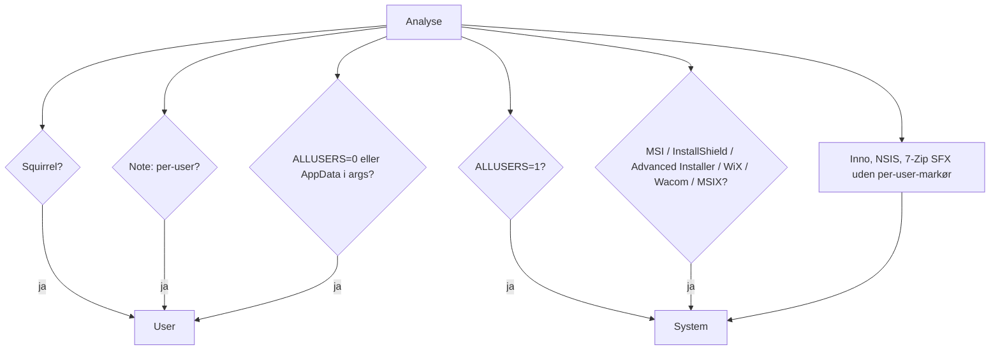

Stien til installeren under `%LOCALAPPDATA%\Temp` tæller **ikke** som user-context – kun argumenterne efter filstien.

### Standard: System (maskininstallation)

De fleste virksomheds-Win32-pakker skal køre som system: MSI med `ALLUSERS=1`, InstallShield, Advanced Installer, Inno/NSIS uden per-user-flag.

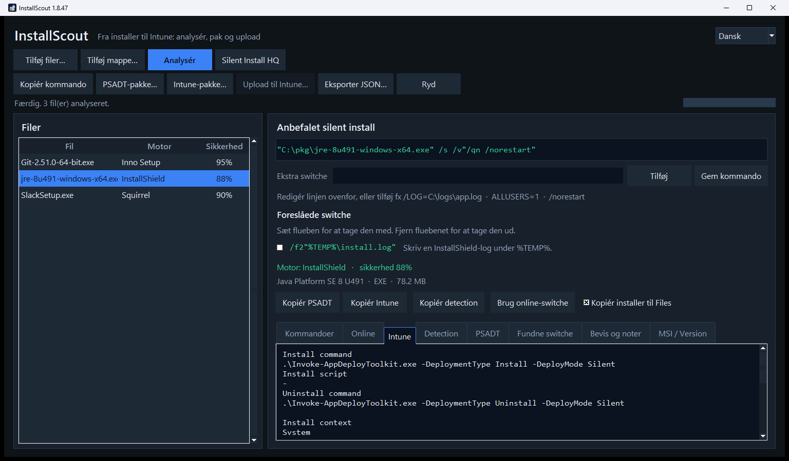

```text
Install context
System
InstallShield er typisk maskininstallation og kræver system context.

Minimum operating system     Windows 10 22H2
Installation time required   60
Device restart behavior      No specific action
```

Samme standardfelter bruges ved upload til Intune.

### Undtagelsen: User (per-bruger)

Squirrel (Slack, flere Electron-apps), `InstallAllUsers=0` / `ALLUSERS=0`, eller installation der eksplicit peger på AppData.

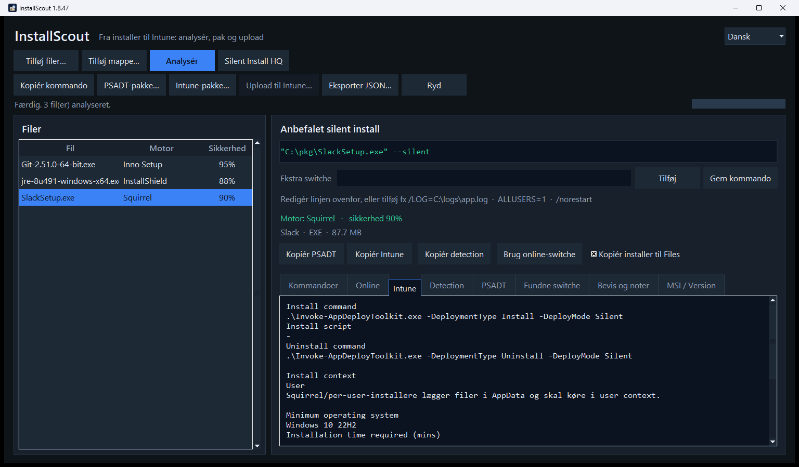

```text
Install context
User
Squirrel/per-user-installere lægger filer i AppData og skal køre i user context.
```

I **Upload til Intune** er System/User forhåndsvalgt, men du kan skifte, hvis du kender pakken bedre end automatikken.

**Hvorfor det betyder noget**

| Context | Typisk mål | Detection |
|---|---|---|
| System | `C:\Program Files`, HKLM Uninstall | Maskin-ARP / MSI ProductCode |
| User | `%LOCALAPPDATA%`, HKCU Uninstall | Brugerens Uninstall-nøgle – virker ikke, hvis appen kører som system |

---

## 6. Upload til Intune

Upload er et **to-trins løb**: først en lokal `.intunewin`, derefter **Upload til Intune**. Programmet uploader den pakke, du allerede har gemt – den pakker ikke forfra ved upload.

```text
Analysér  →  Intune-pakke… (lokal .intunewin)  →  Upload til Intune… (Graph-upload)
```

Det, der lander i Intune, er en Win32-app med:

- install- og uninstall-kommando (`Invoke-AppDeployToolkit.exe … Silent`)
- custom detection-script (`Detection.ps1`, 64-bit PowerShell). Se **Detection** nedenfor.
- **Install context** (System eller User – forhåndsudfyldt, kan overstyres)
- **App-logo** (`largeIcon` i Company Portal – fra EXE, fil eller udklipsholder)
- Minimum OS **Windows 10 22H2**, **60** minutter, genstart **No specific action**

### Trin 1 – lokal Intune-pakke

**Intune-pakke…** gemmer:

| Fil | Indhold |
|---|---|
| `*.intunewin` | Krypteret Win32-indhold (samme format som Microsoft Win32 Content Prep) |
| PSADT-kilde | `Invoke-AppDeployToolkit.exe` + script + `Files\` |
| `Intune.txt` | Felter til portalen |
| `Detection.ps1` | Custom detection |

### Detection

Intune regner appen som installeret, når `Detection.ps1` afslutter med kode 0 og skriver en linje til STDOUT. Tomt output betyder ikke installeret. Scriptet kaster ikke en fejl. Samme regler gælder for alle leverandører.

| Det installeren har | Det der matches |
|---|---|
| Product code (MSI, eller en GUID i afinstallationskommandoen) | Den kode i afinstallationsregistret, og versionen |
| EXE uden product code | Visningsnavn, udgiver og version |
| MSIX | Pakkenavn, og versionen når den kendes |

- **Navn.** Afinstallationsnavnet må være produktet uden et efterstillet Installer, Setup eller Bootstrapper. `Logi Options+ Installer` matcher `Logi Options+`. Et generisk restord som Advanced bruges ikke som navn.
- **Udgiver.** Selskabsendelser ignoreres, så `Logitech, Inc.` matcher `Logitech`, og `Microsoft Corporation` matcher `Microsoft`.
- **Version.** Når installeren har en version, skal `DisplayVersion` være den samme eller nyere. Sammenligningen er numerisk. For en installer på `2.7.961922` tæller den version og `2.8.1`; `2.6` gør ikke. `2.8.1` er kun et eksempel på sammenligningen. Hvis der ikke blev læst en version, kræves version ikke.
- Product code prøves først. Når den mangler, bruges navn, udgiver og version. Både maskinens og brugerens afinstallationsnøgler læses.

Indtil pakken findes for den valgte fil, er **Upload til Intune** grå. Når pakken er gemt, bliver knappen aktiv:

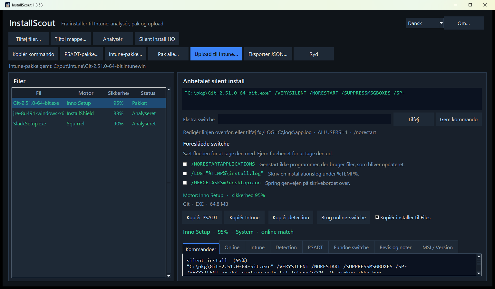

Test kilden før upload:

```powershell
.\Invoke-AppDeployToolkit.exe -DeploymentType Install -DeployMode Silent
```

### Trin 2 – Upload til Intune

Klik **Upload til Intune…**. Dialogen tilpasser højden, så indholdet er synligt uden at scrolle. Nederst vises én Edge-profil. Fold feltet ud for at vælge en anden. **Log på Intune**, **Annuller** og **Upload** står på samme række.

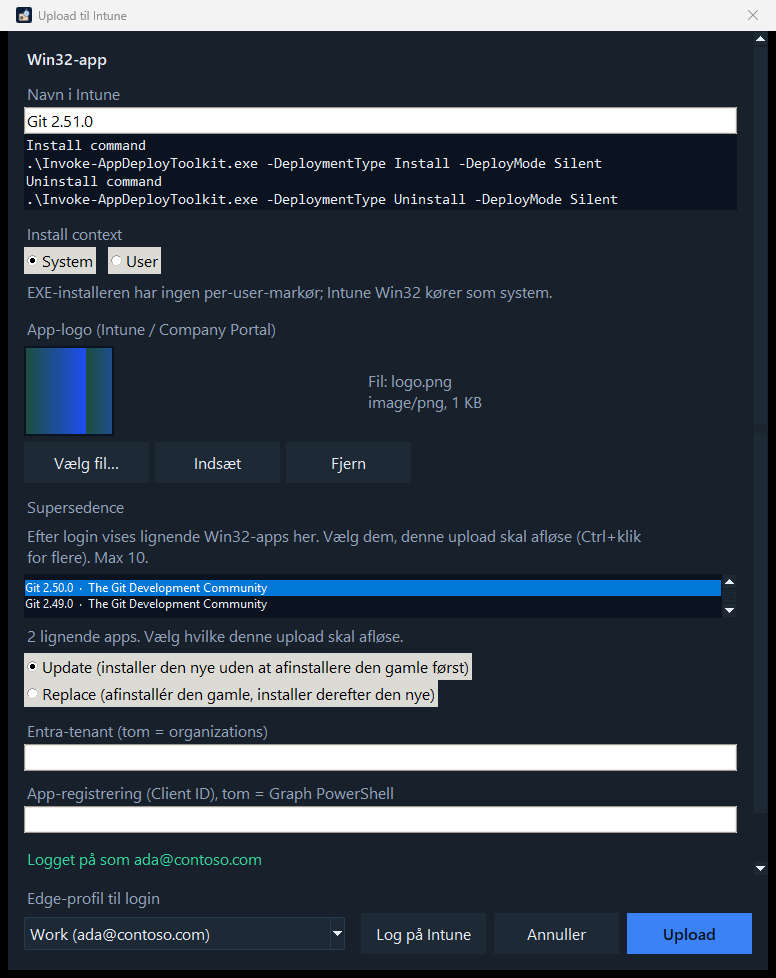

**Logo**

- InstallScout prøver først at trække ikonet ud af EXE’en (og kigger efter `logo.png` / `icon.ico` ved siden af filen).
- **Vælg fil…** – PNG, JPEG, ICO, GIF eller BMP.
- **Indsæt** (Ctrl+V) – billede eller fil fra udklipsholderen.
- **Fjern** – upload uden logo.
- MSI har ofte kun Windows’ standardikon; brug fil eller indsæt.

**I dialogen**

1. Ret **Navn i Intune**, hvis det fundne navn ikke skal stå i Company Portal. Versionen bliver i Display version.
2. Tjek install, uninstall og detection-opsummering.
3. Bekræft **Install context** (System/User). Skift kun hvis du kender pakken bedre.
4. Tjek **app-logo** (preview). Overstyr med fil eller indsæt, hvis automatikken rammer forkert.
5. Tenant og Client ID kan stå tomme: da bruges *organizations* og Microsoft Graph PowerShell. InstallScout opretter **ikke** en Entra-app.
6. Feltet **Edge-profil til login** viser den valgte profil. Arbejdsprofilen vælges, når den kan genkendes. Fold listen ud for at vælge en anden.
7. **Log på Intune** – browser-login (PKCE, localhost) i den valgte Edge-profil. Device code bruges ikke, fordi Conditional Access ofte blokerer det.
8. Efter login: vælg evt. **supersedence** (se nedenfor). Ingenting vælges automatisk.
9. **Upload** – opretter appen, uploader `.intunewin`, sætter detection, logo og evt. supersedence. Statuslinjen viser fremdrift.

### Supersedence

I **Upload til Intune** kan den nye Win32-app afløse ældre versioner i tenant – samme funktion som *Supersedence* i Intune-portalen.

Vent til status er **Logget på som …**, ikke kun at Edge-profilen er åbnet. Først da slår InstallScout Win32-apps op. Søget bruger **produktnavnet** (`startswith` på `displayName`), ikke hele Win32-kataloget. Listen viser apps, der ligner navnet – fx *Git 2.50.0* når du sender *Git 2.51.0*. Samme vendor med et andet produkt kommer typisk ikke med.

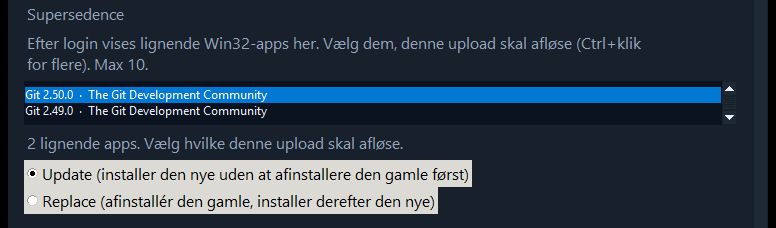

- Ingenting vælges automatisk. Markér med Ctrl+klik (højst **10** – Intunes grænse).
- **Update** (standard) – installer den nye uden at afinstallere den gamle først.
- **Replace** – afinstallér den gamle, installer derefter den nye.
- Relationerne skrives først, når den nye app er oprettet (Graph `updateRelationships`).
- Hvis supersedence fejler, bliver den nye app stående. Dialogen viser hvilke apps der blev superseded, eller fejlen. Du kan sætte relationen i portalen bagefter.

```powershell
.\InstallScoutPortable.exe --cli .\setup.exe --intune C:\out\intune --publish-intune --supersede update
.\InstallScoutPortable.exe --cli .\setup.exe --intune C:\out\intune --publish-intune --supersede replace --supersede-id <app-guid>
```

`--supersede update|replace` matcher på produktnavnet som i GUI. `--supersede-id` kan gentages, hvis du kender Intune-app-id’et.

Efter succes åbnes et link til appen i Intune-portalen.

**Hvad Graph skriver på appen**

| Felt | Værdi |
|---|---|
| App-type | Win32 (`win32LobApp`) |
| Install command | `.\Invoke-AppDeployToolkit.exe -DeploymentType Install -DeployMode Silent` |
| Uninstall command | `.\Invoke-AppDeployToolkit.exe -DeploymentType Uninstall -DeployMode Silent` |
| Detection | PowerShell-script, ikke 32-bit, uden signaturkrav |
| runAsAccount | `system` eller `user` |
| Minimum OS | Windows 10 22H2 |
| Max runtime | 60 minutter |
| Restart | No specific action (`suppress`) |
| Logo | `largeIcon` (PNG/JPEG fra EXE, fil eller udklipsholder) |
| Supersedence | Valgfrit: **Update** eller **Replace** mod op til 10 ældre Win32-apps |

### PSADT-pakke uden Intune

**PSADT-pakke…** er den samme kilde uden `.intunewin` – nyttig til VM-test, før du pakker til Intune.

### Kommandolinje-upload

```powershell
.\InstallScoutPortable.exe --cli .\setup.exe --intune C:\out\intune --publish-intune --icon .\logo.png
```

`--publish-intune` kræver `--intune` (lokal pakke først), ligesom i GUI. Uden `--icon` trækkes logoet fra EXE’en, hvis det findes.

### Login og rettigheder

Login åbner i browseren med PKCE. Device code bruges ikke.

Windows DPAPI krypterer access-token og refresh-token for den aktuelle Windows-bruger i `%LOCALAPPDATA%\InstallScout\graph.json`. Den gemte session er bundet til den valgte tenant og det valgte Client ID. Et andet par genbruger den ikke. En tokenfil i klartekst fra en ældre version slettes og kan ikke bruges. Log af sletter filen.

- Windows 10 eller 11. Opslag af switche og en lokal pakke kræver ikke Azure.
- Microsoft Edge. Login åbner i en Edge-profil.
- En konto der kan oprette Win32-apps: Entra-rollen **Intune Administrator**, eller Intune-rollen **Application Manager**. En brugerdefineret rolle med de samme app-rettigheder dur også.
- Admin-consent i tenant for `DeviceManagementApps.ReadWrite.All`.
- Standard Client ID: Microsoft Graph PowerShell (`14d82eec-204b-4c2f-b7e8-296a70dab67e`). InstallScout opretter ikke en app-registrering.
- Conditional Access kan stadig blokere. IT kan oprette en public client med redirect `http://localhost` og sætte Client ID i dialogen.

---

## 7. Kommandolinje

`InstallScoutPortable.exe` uden argumenter åbner GUI. Til scripts:

```powershell
# Lokal analyse
.\InstallScoutPortable.exe --cli "C:\installers\Git-64-bit.exe"

# Lokal + online
.\InstallScoutPortable.exe --cli "C:\installers\jre-8u491-windows-x64.exe" --online

# Silent Install HQ (navnesøgning i browseren; uploader ikke filen)
.\InstallScoutPortable.exe --cli "C:\installers\DDPM-Setup.exe" --sihq

# JSON
.\InstallScoutPortable.exe --cli .\setup.exe --json --out .\analyse.json

# Extra switche
.\InstallScoutPortable.exe --cli .\setup.exe --switches "/LOG=C:\logs\app.log"

# Lokal Intune-pakke
.\InstallScoutPortable.exe --cli .\setup.exe --intune C:\out\intune

# Pakke + upload + logo (kræver --intune)
.\InstallScoutPortable.exe --cli .\setup.exe --intune C:\out\intune --publish-intune --icon .\logo.png

# Upload og supersede matchende Win32-apps
.\InstallScoutPortable.exe --cli .\setup.exe --intune C:\out\intune --publish-intune --supersede update
```

Fra kilde: `python -m installscout` med de samme flag.

---

## 8. Understøttede motorer

MSI, Inno Setup, NSIS, InstallShield, WiX Burn, Advanced Installer, InstallAware, BitRock, Squirrel, Wise, install4j, Qt Installer, 7-Zip SFX, Wacom, WinRAR SFX, IExpress, Self Extractor, DDPM, MSIX/AppX, ClickOnce.

Ukendt motor: kig i **Fundne switche** og **Bevis**. Analysér spørger også WinGet og Chocolatey og bruger det hit, når det lokale gæt er svagt. Wrappers og ukendte EXE’er udpakkes lokalt først, så en indre MSI kan erstatte *Unknown 15 %*.

---

## 9. Grænser

- Downloadet er **ikke codesigned**. Windows eller virksomhedens sikkerhed kan advare eller blokere det. Vælg Behold / Kør alligevel, bed IT om at tillade filen, eller prøv den i en VM eller Windows Sandbox uden de politikker.
- Programmet **installerer ikke** noget. Udpakning kører aldrig installeren. Test silent-linjen i en VM.
- Online-kataloger kender ofte et andet navn eller en nyere build end din fil. Wrapper-VersionInfo (*Self Extractor*) er ikke et katalogprodukt.
- Context er et kvalificeret gæt. Overstyr i Upload til Intune, hvis du ved bedre.
- Intune-upload kræver Graph-rettighed og kan ramme Conditional Access.
- Binære installere sendes ikke på nettet ved online-tjek.
- Upload til Intune er inaktiv, indtil der findes en lokal `.intunewin` for den valgte fil.
- MSI har ofte intet brugbart ikon. Brug **Vælg fil…** eller **Indsæt**.
- Manuelle switche overskriver den anbefalede linje i PSADT; test i en VM.
- Supersedence-listen vises først, når login er færdig (*Logget på som …*).
- Hvis supersedence fejler, ligger den nye Win32-app stadig i Intune.
